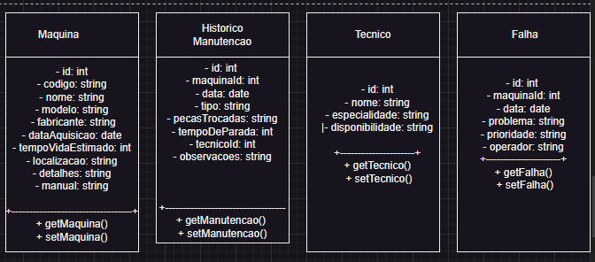
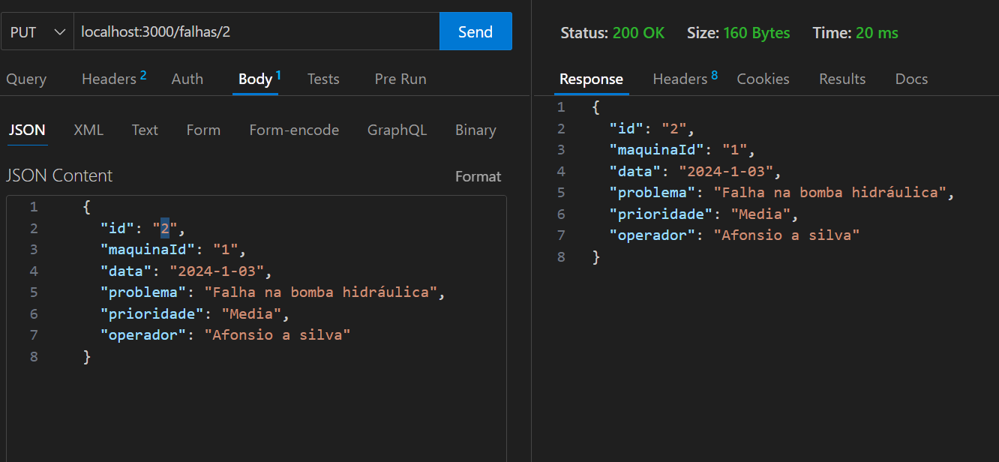

<!-- Documentação Técnica do Projeto -->

Definição do Tema

O Sistema de Manutenção Preventiva e Corretiva é um software projetado para gerenciar o ciclo de vida de máquinas e equipamentos industriais, focado em minimizar o tempo de inatividade e otimizar o desempenho operacional. O sistema permite:

    Controle de manutenções preventivas (realizadas regularmente para evitar falhas) e corretivas (após uma falha).
    Registro de falhas, gerenciamento de técnicos, geração de relatórios e acompanhamento de indicadores de desempenho, como MTTR (Mean Time to Repair) e MTBF (Mean Time Between Failures).

Análise de Requisitos e Escopo
Funcionalidades Principais

    Gerenciamento de Máquinas e Equipamentos:
        Cadastro de máquinas com especificações técnicas, data de aquisição e localização.
        Visualização e edição de informações das máquinas.

    Registro e Controle de Manutenções:
        Registro de manutenções preventivas e corretivas.
        Histórico completo de manutenções para cada máquina, incluindo peças trocadas e tempo de inatividade.

    Gerenciamento de Falhas:
        Registro de falhas, categorizadas por severidade e associadas a operadores.
        Controle de falhas por máquina.

    Gerenciamento de Técnicos:
        Cadastro de técnicos, com suas especialidades e disponibilidade.

    Relatórios e Indicadores:
        Geração de relatórios sobre manutenção, falhas, tempo de inatividade e peças trocadas.
        Cálculo de indicadores como MTTR e MTBF.

    Integração com API:
        Utilização de uma API REST (JSON-Server) para armazenar e recuperar dados.

Requisitos Funcionais

    O sistema deve permitir o cadastro de máquinas com suas especificações.
    O sistema deve registrar manutenções preventivas e corretivas, associando técnicos e peças trocadas.
    O sistema deve gerar relatórios de manutenção e indicadores de performance.
    O sistema deve oferecer uma interface gráfica intuitiva.

Requisitos Não Funcionais

    O sistema deve ser responsivo, com tempos de resposta rápidos ao interagir com a API.
    A interface deve ser amigável, facilitando a navegação.
    O sistema deve garantir segurança e eficiência no armazenamento e recuperação de dados.

Escopo
Objetivos

    Específico: Desenvolver e implementar um módulo com interface gráfica utilizando Java Swing para gerenciamento de máquinas, técnicos e manutenções, incluindo o registro de manutenções corretivas.
    Mensurável: Sucesso será mensurado pela conclusão das funcionalidades de CRUD (Criar, Ler, Atualizar e Deletar) para máquinas, manutenções, falhas e técnicos.
    Atingível: Funcionalidades serão desenvolvidas seguindo um cronograma detalhado, priorizando módulos críticos e utilizando Java Swing para o frontend e integração com backend.
    Relevante: Essencial para melhorar a manutenção de máquinas, aumentando a eficiência e reduzindo o tempo de inatividade. Integração com uma API garantirá a sincronização em tempo real.
    Temporal: O módulo de manutenções preventivas, incluindo validação e testes, será concluído em 5 dias.

Levantamento de Recursos

    Ferramentas:
        Java Swing
        Visual Studio Code
        Git
        JSON
        Bibliotecas Java
        JUnit

Análise de Riscos

    Problemas de conectividade ou lentidão na API:
        Mitigação: Monitorar a performance da API, implementar mecanismos de fallback e otimizar o desempenho da aplicação.

    Desafios na criação de uma interface gráfica amigável:
        Mitigação: Utilizar bibliotecas ou frameworks que facilitam o design de interfaces intuitivas.

    Atrasos no cronograma:
        Mitigação: Utilizar metodologias ágeis, com sprints curtos, revisões periódicas e comunicação clara entre a equipe para detectar e resolver problemas rapidamente.

    Problemas de segurança:
        Mitigação: Implementar boas práticas de segurança, como criptografia de dados e autenticação forte.

    Erros no armazenamento ou recuperação de dados:
        Mitigação: Implementar testes de consistência e validação dos dados antes de inseri-los ou atualizá-los no sistema.

Diagrama de Classes

Diagrama de Sequência

Testes da API
Maquinas

GET:

POST:

PUT:

DELETE

Manutenções

GET:

POST:

PUT:

Falhas

GET:

POST:

PUT:

tecnicos

GET:

POST:

PUT:

DELETE:

